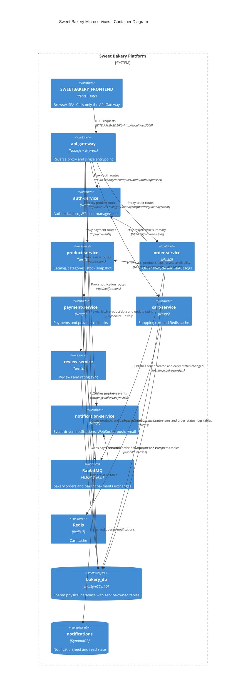

# Sweet Bakery Backend Architecture

> Tài liệu này mô tả kiến trúc **thực tế đang có trong workspace**, dựa trên `docker-compose.yml`, cấu hình service, schema khởi tạo PostgreSQL, API Gateway, RabbitMQ và source code NestJS/Express hiện hữu.

## 1. Tổng Quan Dự Án

Sweet Bakery là một hệ thống bán bánh theo mô hình **Microservices** với các dịch vụ tách biệt theo nghiệp vụ: **auth**, **product**, **order**, **payment**, **cart**, **review**, **notification** và **api-gateway** làm cổng vào duy nhất cho frontend.

### Thành phần công nghệ hiện tại

| Thành phần | Công nghệ | Vai trò | Ghi chú hiện trạng |
|---|---|---|---|
| Frontend | React + Vite | Giao diện người dùng | Chỉ gọi API Gateway |
| API Gateway | Express + `http-proxy-middleware` | Reverse proxy, routing, CORS, rate limit | Có hai implementation song song (`main.js` và `src/app.js`), bản chạy thực tế theo `main.js`/`src/app.js` |
| Auth Service | NestJS + TypeORM + PostgreSQL | Đăng nhập, JWT, user management | Dùng bảng `users` |
| Product Service | NestJS + TypeORM + PostgreSQL | Catalog, categories, stock snapshot | Dùng bảng `products`, `categories` |
| Order Service | NestJS + TypeORM + PostgreSQL + RabbitMQ client logic | Tạo đơn, cập nhật trạng thái, status logs | Gọi sync sang auth/product, publish event ra broker |
| Payment Service | NestJS + TypeORM + PostgreSQL | Thanh toán, callback provider, refund | Hiện chưa thấy publisher RabbitMQ trong source chính |
| Cart Service | NestJS + TypeORM + PostgreSQL + Redis | Giỏ hàng, cache | Redis được dùng rõ trong code |
| Review Service | NestJS + TypeORM + PostgreSQL + HttpService | Review và cập nhật rating product | Có gọi HTTP sang Product Service |
| Notification Service | NestJS + RabbitMQ + WebSocket + DynamoDB + Mailer | Nhận event, push realtime, gửi email | Dùng `@golevelup/nestjs-rabbitmq` và Socket.IO gateway |
| PostgreSQL | Docker PostgreSQL 15 | Lưu dữ liệu nghiệp vụ | Hiện là **một DB vật lý chung** `bakery_db` với phân quyền/table ownership theo service |
| RabbitMQ | Docker RabbitMQ 3.13 | Message broker | Có exchanges `bakery.orders`, `bakery.payments`, `bakery.notify` |
| Redis | Docker Redis 7 | Cache | Dùng cho cart |
| DynamoDB | AWS SDK | Notification store | Dùng trong notification-service |

> Điểm quan trọng nhất: kiến trúc này **không phải database-per-service theo nghĩa vật lý tách database riêng cho mỗi service**. Code và schema khởi tạo hiện cho thấy một **PostgreSQL vật lý chung** `bakery_db`, nhưng từng service chỉ sở hữu bảng của mình thông qua schema/table ownership và role grants.

## 2. Các Phong Cách Kiến Trúc Đang Áp Dụng

| Phong cách | Mức độ áp dụng | Bằng chứng trong code |
|---|---|---|
| **Microservices** | Rõ ràng | Mỗi service có thư mục riêng, package riêng, cổng riêng |
| **API Gateway** | Rõ ràng | `api-gateway` proxy request tới từng service |
| **Database ownership by service** | Rõ ràng ở mức logic | `docker/postgres/init/09_microservice_permissions.sql` cấp quyền theo bảng |
| **Event-Driven Architecture** | Rõ ràng ở notification | Order publish event, Notification consume từ RabbitMQ |
| **Saga-style orchestration** | Một phần, theo kiểu choreography nhẹ | Order tạo/đổi trạng thái rồi phát event cho downstream |
| **CQRS** | Chỉ áp dụng nhẹ | Có pattern tách đọc/ghi ở một số nơi, nhưng chưa phải CQRS đầy đủ |
| **Event Sourcing** | Chưa áp dụng thực sự | Chỉ có event publish và audit log trạng thái, không phải event store |
| **Cache-aside / caching** | Có | Cart service dùng Redis |
| **Real-time push** | Có | Notification service dùng WebSocket/Socket.IO |

## 3. Architecture Characteristics

| Đặc tính | Mức độ | Nhận xét |
|---|---|---|
| **Scalability** | Tốt | Mỗi service có thể scale độc lập; gateway giúp phân luồng |
| **Availability** | Khá | Tách service giảm blast radius, nhưng broker và DB chung vẫn là điểm tập trung |
| **Consistency** | Trung bình | Order/payment/notification có eventual consistency qua event bus |
| **Maintainability** | Khá tốt | Mỗi domain tách folder, module, package |
| **Modularity** | Tốt | Ranh giới service rõ theo bounded context |
| **Performance** | Khá | Cache Redis hỗ trợ cart; sync calls vẫn tạo latency |
| **Fault tolerance** | Trung bình | Có fallback/logging, nhưng retry/circuit breaker còn hạn chế |
| **Security** | Khá | Gateway, CORS, auth middleware, role grant DB |
| **Observability** | Trung bình | Có log, nhưng chưa thấy tracing/metrics chuẩn production |
| **Testability** | Khá | Có test/spec ở nhiều service, nhưng coverage chưa đồng đều |

> Hệ thống có nền tảng tốt cho scale và tách domain, nhưng vẫn còn phụ thuộc vào PostgreSQL chung và các kết nối sync trực tiếp trong order flow.

## 4. Vì Sao Kiến Trúc Này Hợp Lý Cho Bài Toán Đặt Hàng

### Lý do lựa chọn

- **Order** là quy trình trung tâm, nhưng không nên chứa toàn bộ logic catalog, auth, payment, notification.
- **Product**, **Auth**, **Payment** và **Notification** có vòng đời khác nhau, nên tách thành service riêng giúp giảm coupling.
- **Order creation** cần đọc dữ liệu từ nhiều domain khác nhau, phù hợp với **sync validation** + **async event publication**.
- **Notification** là tác vụ phụ trợ theo sự kiện, phù hợp nhất với **event-driven**.

### Tính hợp lý theo nghiệp vụ

| Nhu cầu nghiệp vụ | Cách kiến trúc đáp ứng |
|---|---|
| Xác thực user trước khi đặt hàng | Order-service gọi sync sang Auth-service |
| Chốt giá/kiểm tra tồn kho | Order-service gọi sync sang Product-service để lấy snapshot |
| Gửi thông báo khi tạo đơn | Order-service publish event, Notification-service consume |
| Cập nhật trạng thái đơn | Order-service phát event trạng thái mới |
| Truy vết giao dịch | Order-status logs và notification records hỗ trợ audit nhẹ |

## 5. Happy Path & Failure Path (Saga/Choreography)

### Happy path: tạo đơn hàng

1. Frontend gửi request vào **API Gateway**.
2. Gateway proxy tới **Order Service**.
3. Order Service gọi sync sang **Auth Service** để kiểm tra user còn hoạt động.
4. Order Service gọi sync sang **Product Service** để lấy snapshot giá/tình trạng sản phẩm.
5. Order Service tính tổng tiền, lưu `orders`, `order_items`, `order_status_logs` trong PostgreSQL.
6. Order Service publish `order.created` ra **RabbitMQ exchange `bakery.orders`**.
7. Notification Service consume event, lưu notification vào DynamoDB, push realtime qua WebSocket và gửi email khi cần.

### Failure path: user không hợp lệ hoặc sản phẩm không khả dụng

| Điểm lỗi | Hành vi hiện tại |
|---|---|
| Auth-service trả user inactive | Order Service ném `BadRequestException` |
| Product-service trả product unavailable | Order Service dừng flow trước khi ghi DB |
| Tổng tiền không khớp snapshot | Order Service reject request |
| RabbitMQ không publish được | Order vẫn đã commit DB, event publish có logging fallback; đây là điểm cần cải thiện |

### Failure path: downstream notification lỗi

| Lỗi downstream | Tác động |
|---|---|
| Notification consumer lỗi | Order vẫn có thể được tạo, nhưng thông báo bị chậm hoặc mất nếu không có retry/DLQ đầy đủ |
| Mail service lỗi | Realtime WebSocket vẫn có thể hoạt động, nhưng email thất bại |

> Đây là **choreography-style saga nhẹ**, không phải orchestration saga đầy đủ với state machine và compensation phức tạp.

## 6. Phân Tích Cốt Lõi Theo Design Pattern

### 6.1 API Gateway

| Mục | Nội dung |
|---|---|
| Là gì | Cổng vào duy nhất cho frontend, proxy request đến service con |
| Hoạt động thế nào | Dùng `http-proxy-middleware`, rewrite path, forward header auth/cookie |
| Áp dụng ở đâu | `api-gateway/main.js`, `api-gateway/src/app.js`, `api-gateway/src/routes/index.js` |
| Đánh giá / cải thiện | Hợp lý cho một backend microservices; nên chuẩn hóa còn 1 implementation và thêm service discovery/config central |

### 6.2 Repository Pattern

| Mục | Nội dung |
|---|---|
| Là gì | Tách truy cập dữ liệu khỏi service logic |
| Hoạt động thế nào | Repository bao bọc TypeORM repository |
| Áp dụng ở đâu | `order-service/src/order/repositories/*`, các module TypeORM của các service |
| Đánh giá / cải thiện | Hợp lý; nên đồng bộ contract và naming giữa các service |

### 6.3 Service Layer / Use Case Layer

| Mục | Nội dung |
|---|---|
| Là gì | Nơi chứa business rules và orchestration |
| Hoạt động thế nào | Controller mỏng, service xử lý nghiệp vụ |
| Áp dụng ở đâu | `order.service.ts`, `payment.service.ts`, `notification.service.ts` |
| Đánh giá / cải thiện | Đúng hướng; nên giảm logic phụ trợ trong service lớn bằng cách tách use case nếu phình to |

### 6.4 Publisher/Consumer Pattern

| Mục | Nội dung |
|---|---|
| Là gì | Producer phát event, consumer xử lý bất đồng bộ |
| Hoạt động thế nào | Order publish event ra `bakery.orders`; Notification subscribe |
| Áp dụng ở đâu | `order.publisher.ts`, `notification/consumers/*.ts` |
| Đánh giá / cải thiện | Hợp lý; nên bổ sung DLQ, retry policy và idempotency |

### 6.5 Cache Pattern

| Mục | Nội dung |
|---|---|
| Là gì | Lưu dữ liệu truy cập nhiều, giảm tải DB |
| Hoạt động thế nào | Cart service dùng Redis cache theo `userId` |
| Áp dụng ở đâu | `cart/cache.ts`, `cart.module.ts` |
| Đánh giá / cải thiện | Hợp lý; nên làm rõ cache invalidation và TTL chiến lược |

### 6.6 Gateway WebSocket Push

| Mục | Nội dung |
|---|---|
| Là gì | Push realtime cho client |
| Hoạt động thế nào | Notification gateway dùng Socket.IO room theo `userId` |
| Áp dụng ở đâu | `notification.gateway.ts` |
| Đánh giá / cải thiện | Rất phù hợp với notification realtime; nếu cần **SSE** thì hiện chưa có implementation, phải bổ sung riêng |

## 7. CQRS và Event Sourcing

| Chủ đề | Mức độ áp dụng | Nhận xét |
|---|---|---|
| **CQRS** | Nhẹ | Có một số dấu hiệu tách read/write, nhưng chưa có command/query model rõ ràng toàn hệ thống |
| **Event Sourcing** | Chưa áp dụng | Event chỉ dùng để truyền trạng thái và thông báo, không lưu làm nguồn sự thật |
| **Audit log** | Có | `order_status_logs` đóng vai trò audit trail tốt |

> Không nên gọi hệ thống này là **CQRS/Event Sourcing full-fledged**. Chính xác hơn là: **event-driven with lightweight audit logging**.

## 8. Cơ Chế Sync, Async và Realtime

### Đồng bộ (Sync)

| Luồng | Cơ chế | Mục đích |
|---|---|---|
| Order -> Auth | HTTP fetch | Kiểm tra user active |
| Order -> Product | HTTP fetch | Lấy product snapshot và availability |
| Review -> Product | HttpService + axios | Update rating và đọc dữ liệu product |

### Bất đồng bộ (Async)

| Luồng | Exchange / routing key | Mục đích |
|---|---|---|
| Order -> Notification | `bakery.orders` / `order.created`, `order.status.*` | Tạo thông báo sau khi tạo/cập nhật đơn |
| Payment -> Notification | `bakery.payments` / `payment.success`, `payment.failed`, `payment.refunded` | Gửi thông báo thanh toán |

### Realtime push

| Cơ chế | Trạng thái |
|---|---|
| WebSocket / Socket.IO | Đang dùng trong notification-service |
| SSE | Chưa thấy trong source hiện tại |

> Nếu mục tiêu là realtime notification cho frontend, **WebSocket** hiện là lựa chọn đã có trong code; **SSE** chỉ nên xem là hướng mở rộng, không phải trạng thái hiện tại.

## 9. Hạ Tầng DevOps Hiện Có Và Phần Còn Thiếu Cho Production

### Hiện có

| Hạng mục | Trạng thái |
|---|---|
| `docker-compose.yml` | Có |
| PostgreSQL container | Có |
| RabbitMQ container | Có |
| Redis container | Có |
| Init scripts cho DB/broker | Có |
| Service Dockerfiles | Có ở từng service |
| CORS / proxy config | Có |
| Basic logging | Có |
| Một số test/spec | Có |

### Còn thiếu hoặc chưa thấy rõ cho Production

| Hạng mục | Nhận xét |
|---|---|
| Kubernetes / orchestration | Chưa thấy |
| Centralized secrets management | Chưa thấy |
| Observability chuẩn production | Thiếu metrics, tracing, structured log aggregation |
| Health/readiness probes đầy đủ | Chưa đồng đều |
| CI/CD pipeline | Chưa thấy trong workspace |
| Retry / circuit breaker / DLQ chuẩn hóa | Chưa đầy đủ |
| Backup/restore strategy | Chưa thể hiện rõ |
| API versioning governance | Có một phần, nhưng cần chuẩn hóa thêm |
| Database per service theo nghĩa vật lý | Chưa đạt, hiện là DB chung với schema/table isolation |

## 10. Kết Luận

> Kiến trúc hiện tại là một **microservices architecture thực dụng**, có **API Gateway**, **event-driven notification flow**, **service-owned tables**, **Redis cache** và **real-time push**. Nó phù hợp với bài toán đặt hàng vì cân bằng được tính tách biệt domain và tốc độ triển khai.

### Điểm mạnh

- Ranh giới domain khá rõ.
- Order flow dùng đúng kết hợp **sync validation** và **async eventing**.
- Notification đã tách khỏi order/payment, giảm coupling.
- Có cơ chế cache cho cart và audit log cho order.

### Hạn chế

- PostgreSQL hiện là **một DB vật lý chung**, chưa phải database-per-service vật lý.
- Chưa thấy retry/DLQ/circuit breaker đủ mạnh cho production.
- Realtime hiện là **WebSocket**, chưa phải SSE.
- Có dấu hiệu tồn tại hai implementation gateway, cần chuẩn hóa.

### Kết luận cuối

> Nếu triển khai production, kiến trúc này cần bổ sung **observability**, **resilience patterns**, **message reliability**, và tách dần lưu trữ sang mô hình phù hợp hơn. Tuy vậy, với mục tiêu học tập/đồ án và phát triển theo domain, đây là một nền tảng kiến trúc hợp lý và dễ mở rộng.

## Mermaid Diagram

